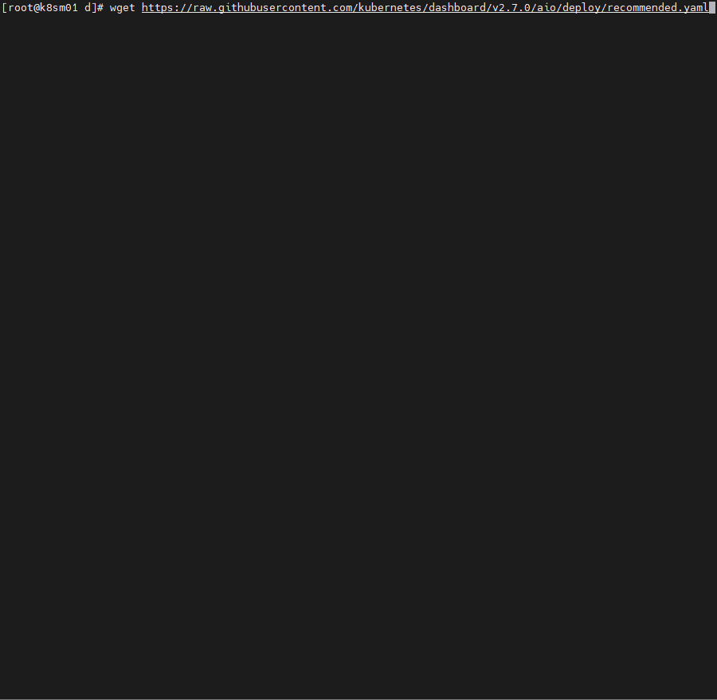

# k8s-dashboard

Створення сервісу kubernetes-dashboard для управління та моніторингу кластера кубернетес!

<a href="https://kubernetes.io/docs/tasks/access-application-cluster/web-ui-dashboard/">Офіційна документація!</a>

1. За допомогою наступної команди вигружаєм маніфести собі в кластер (чи локальну ос).
```shell
 wget https://raw.githubusercontent.com/kubernetes/dashboard/v2.7.0/aio/deploy/recommended.yaml
```

2. Для того щоб отримати доступ з мережі до Dashboard (без використання kubectl port-forward), потрібно оновити з файлу (recommended.yaml) що ми завантажили, Service... а саме:
```shell
 kind: Service
apiVersion: v1
metadata:
  labels:
    k8s-app: kubernetes-dashboard
  name: kubernetes-dashboard
  namespace: kubernetes-dashboard
spec:
  ports:
    - port: 443
      targetPort: 8443
  selector:
    k8s-app: kubernetes-dashboard
```
додаємо тип та порт ... 
```shell
 kind: Service
apiVersion: v1
metadata:
  labels:
    k8s-app: kubernetes-dashboard
  name: kubernetes-dashboard
  namespace: kubernetes-dashboard
spec:
  type: NodePort
  ports:
    - port: 443
      targetPort: 8443
      nodePort: 31111
  selector:
    k8s-app: kubernetes-dashboard
```
до сервісу додаємо NodePort та вказуємо nodePort: 31111 (резервуються порти для NodePort з 30000 - 32767). Перед початко додавання порта рекомендується перевірити чи цей порт не зайнятий. NodePort - відкриє цей порт на кожній ноді кластеру. 

3. Для того щоб ми могли в kubernetes-dashboard виконувати якісь дії (читання, зміни ...), я буду створювати окремого користувача з ролю cluster-admin та типом доступу через токен. Створений обліковий запис буде мати роль cluster-admin та зможе керувати усім кластером!
```shell
kubectl create serviceaccount
kubectl create clusterrolebinding cluster-admin-user --clusterrole=cluster-admin --serviceaccount=default:user
kubectl create token user
```


У разі зміни чи необхідності видалення створених дій!
```shell
kubectl delete serviceaccount user
kubectl delete clusterrolebinding cluster-admin-user
kubectl delete -f recommended.yaml
```

```shell
```
```shell
```
```shell
```
